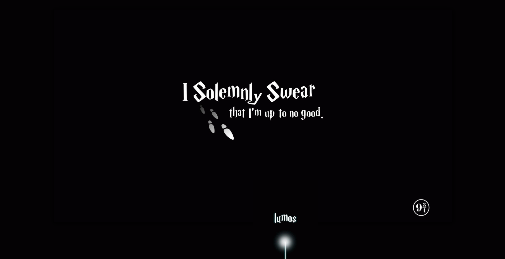
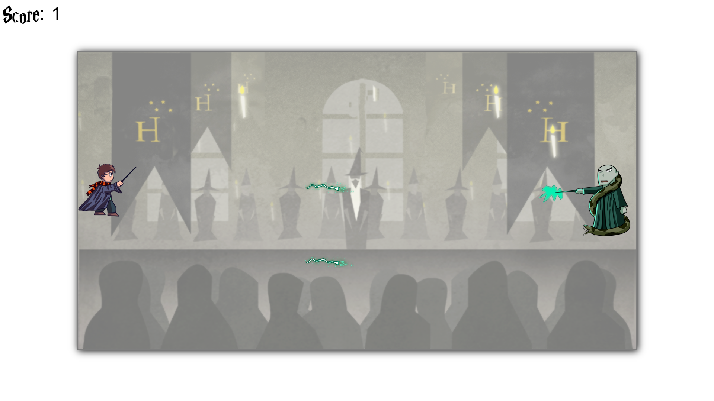

# Harry Potter - the boy who coded
A 2d game based on the Harry Potter movie saga - designed to module 1 of Ironhack Bootcamp, where Harry Potter faces his enemies (well, initially only *the one whose name shall not be pronounced*) in a duel to the death - dodging avada kedavras as long as possible. If Harry gots hit by a spell he will die. Time's increasing also increase your points.

## Screenshots
 

## MVP (DOM - CANVAS)
  - game has a character 
  - the character has 7 lives
  - the character needs to dodge the spells
  - if the character gets hit by a spell he lost 1 live
  - if he lost all the 7 spells, he dies
  - the character's duration will set his score
  - duration will increase the spells speed
## Backlog
  - get all the assets
  - draw the assets in the canvas
  - make the spells go in the left direction
  - add a timer and make them faster with the timer
  - add a score and make the hitbox subtract -1 to the lives
  - add a game over
  - add multiple scenes

## Data Structure

### index.js
  - gameIntro() {}
  - gameBattle() {}
  - gameOver() {}

### game.js
  - draw () {}
  - collision () {}
  - clearCanvas() {}
  - damage() {}
  - harry () {this.x; this.y}
  - spell () {this.x; this.y; this.speed}
  - move() {}
  - gameOver() {}

## Stages
  - gameIntro
  - gameBattle
  - gameOver

## Task - functions
  - game - draw
  - game - harry
  - game - spell
  - game - move
  - game - collision
  - game - damage
  - game - clearCanvas
  - game - gameOver
  - index - gameBattle
  - index - gameIntro
  - index - gameOver

## Useful links

### Trello: [link to trello](https://trello.com/b/UeUWBeLA/harry-potter-the-boy-who-coded)

